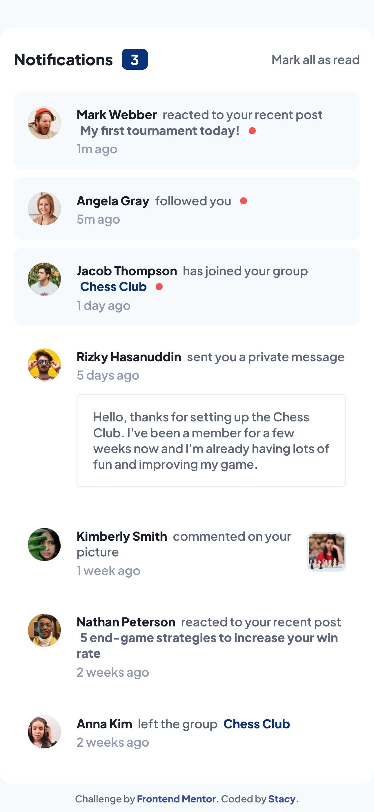

# Frontend Mentor - Notifications page solution

This is a solution to the [Notifications page challenge on Frontend Mentor](https://www.frontendmentor.io/challenges/notifications-page-DqK5QAmKbC). Frontend Mentor challenges help you improve your coding skills by building realistic projects.

### The challenge

Users should be able to:

- Distinguish between "unread" and "read" notifications
- Select "Mark all as read" to toggle the visual state of the unread notifications and set the number of unread messages to zero
- View the optimal layout for the interface depending on their device's screen size
- See hover and focus states for all interactive elements on the page

## Preview



[Demo](https://stautuan.github.io/notifications-page/)

### Built with

```
- JavaScript
- Semantic HTML5 markup
- CSS custom properties
- Flexbox
- CSS Grid
```

### What I learned

This has been one of the most important projects I've ever done so far. I learned how to implement additional Github features, such as creating dev branches and feature branches. I also became familiar with the workflow of:

- Creating Pull Requests
- Make changes to them based on the review
- Commit updates
- Perform squash and merge
- Delete a feature branch after merging, to keep the development clean and organized

I found that learning Git can be more challenging than coding itself and can be overwhelming without any guidance. That's why I'm especially grateful to my mentor, [Aaron](https://github.com/Aaront028), from discord 👋😄 who taught and guided me throughout this learning process. Thank you so much!

### Continued development

Git and Github

## Author

- Frontend Mentor - [@stautuan](https://www.frontendmentor.io/profile/stautuan)

## Acknowledgments

Aaron, from Discord and [Github](https://github.com/Aaront028) 🙏
